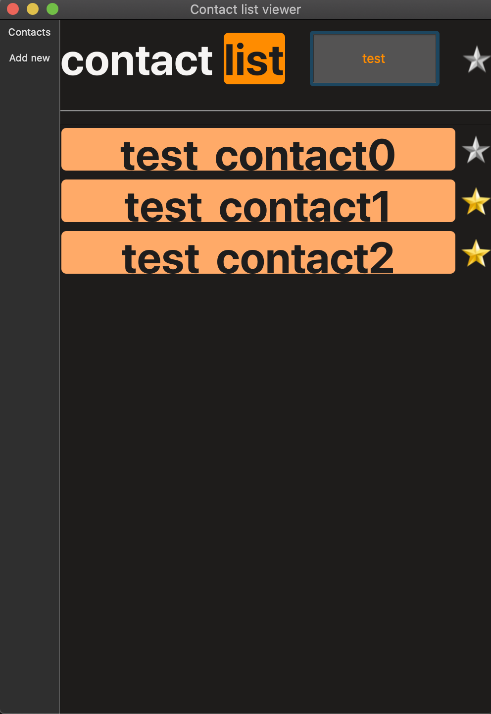

# Utag
___
​
### Description:
    Test project: contactlist - contact list viewer.
### Developers:
 [Maxim Libovych](https://github.com/mlibovych)

​
### Screenshot:
 
​
#### 1.Built with
​
 [CMake](https://cmake.org)
​
#### 2.GUI library
​
 [Qt](https://www.qt.io)

### Installation:
    1. git clone --recursive https://github.com/mlibovych/ContactList
    2. cmake . -Bbuild -Wdev -Werror=dev && cmake --build ./build

### How to use?
    ./contactlist

### License
[MIT](https://choosealicense.com/licenses/mit/)

---
